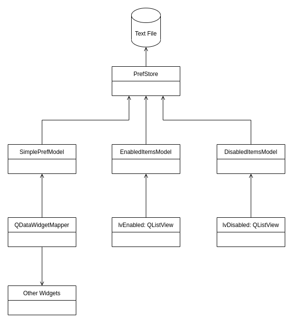

# PyQt5 ModelView Example

Example PyQt5 Application using Qt's Model-View architecture showing the following:

- Use of `QAbstractListModel` to dynamically populate list views
- Applying Model-View architecture to non-Model-aware widgets by using `QAbstractListModel` in a creative way and using `QDataWidgetMapper`
- Separation of concerns:
    - Views only talk to Models without interacting with the data repository layer
    - Models talk to the data repository to get data and adapt it to be displayed in View. Also handles data changes caused by View Actions



## Running (on Linux)
```
git clone https://github.com/kennethso168/PyQt5_ModelView_Example
cd PyQt5_ModelView_Example
python3 -m pip venv .venv
source .venv/bin/activate
pip install -r requirements.txt
pyuic main.ui -o main_ui.py
python3 main.py
```

## Limitations

Note that this is a very simple example so here are the limitations at the moment

- No Tests
- No Data validation
- For production, should have a more robust backend instead of a simple text file
- For simplicity, the whole preference file is simply read/written many times. Better approach is needed for a more complex application